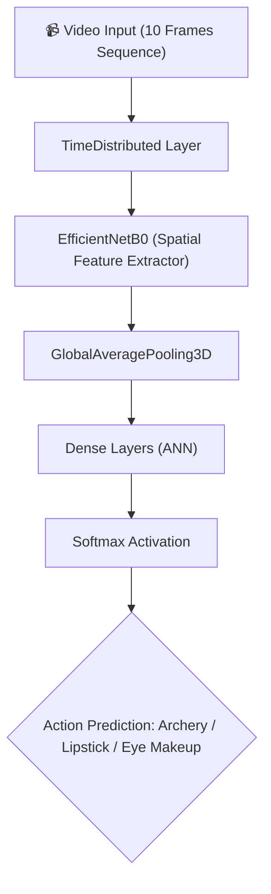

<div align="center">

  <!-- Project Header Logo / Banner Placeholder -->
  <h1>🌟 STAR</h1>
  <h3><i>Spatio-Temporal Action Recognition</i></h3>

  <p>
    An advanced <b>Deep Learning-based web application</b> designed to classify human actions from video sequences by analyzing both spatial features and temporal motion dynamics.
  </p>

  <!-- Badges Row -->
  <p>
    <a href="https://python.org"></a>
    <a href="https://tensorflow.org"></a>
    <a href="https://gradio.app"></a>
    <a href="https://opencv.org"></a>
    <a href="https://numpy.org"></a>
  </p>

  <p>
    <a href="#about-the-project">About</a> •
    <a href="#model-architecture">Architecture</a> •
    <a href="#custom-data-generator">Data Strategy</a> •
    <a href="#frontend-ui">UI Preview</a> •
    <a href="#how-to-run">How to Run</a>
  </p>

  ---

</div>

## 📑 Table of Contents
- [🌟 About The Project](#about-the-project)
- [🧠 Model Architecture (The AI Engine)](#model-architecture)
- [🛠️ Python Libraries Used](#python-libraries-used)
- [🔄 Why We Used a Custom Data Generator?](#custom-data-generator)
- [💻 Frontend UI (Powered by Gradio)](#frontend-ui)
- [🚀 How to Run (Inference)](#how-to-run)
- [📬 Let's Connect!](#lets-connect)

---

<a id="about-the-project"></a>
## 🌟 About The Project

**STAR (Spatio-Temporal Action Recognition)** is an advanced Deep Learning-based web application designed to classify human actions from video sequences. 

Unlike standard image classification models that only look at static pictures, STAR analyzes both **Spatial features** (what is in the frame) and **Temporal features** (how things are moving across multiple frames) to accurately predict the action being performed.

Currently, the model is fine-tuned to recognize specific actions such as:
- 🎯 **Archery**
- 💄 **Applying Lipstick**
- 👁️ **Applying Eye Makeup**

---

<a id="model-architecture"></a>
## 🧠 Model Architecture (The AI Engine)

This project utilizes a state-of-the-art **Time-Distributed CNN architecture**:

- **EfficientNetB0 (Base Model):** Used as a feature extractor. It scans each individual frame of the video to understand the spatial features (objects, people, background).
- **TimeDistributed Layer:** This is the heart of the temporal analysis. It allows the model to process a sequence of 10 consecutive frames simultaneously, grasping the motion and time dynamics.
- **GlobalAveragePooling3D & Dense Layers:** Acts as the Artificial Neural Network (ANN) at the end, consolidating the spatio-temporal data to output the final prediction using a `softmax` activation function.



---

<a id="python-libraries-used"></a>
## 🛠️ Python Libraries Used

The project heavily relies on the following industry-standard libraries:

| Library | Purpose |
| :--- | :--- |
| **`tensorflow` / `keras`** | For building, compiling, and training the deep learning model. |
| **`opencv-python` (`cv2`)** | For video processing, frame extraction, and image resizing. |
| **`numpy`** | For matrix operations and reshaping video frame arrays. |
| **`gradio`** | For building a seamless, interactive web frontend. |
| **`scikit-learn`** | For splitting the dataset into training and validation sets. |

---

<a id="custom-data-generator"></a>
## 🔄 Why We Used a Custom Data Generator?

Working with video datasets (like UCF101) is incredibly memory-intensive. Loading thousands of multi-frame videos directly into memory will instantly crash the system's RAM (especially on cloud platforms or local machines).

To solve this, we built a **Memory-Safe Custom Data Generator**. Instead of loading the entire dataset at once, the generator:
1. Fetches only a small batch of videos at a time.
2. Extracts and preprocesses the frames on the fly.
3. Feeds them to the model and immediately frees up the memory. 

> *This ensures zero RAM crashes and highly efficient training during the machine learning lifecycle.*

---

<a id="frontend-ui"></a>
## 💻 Frontend UI (Powered by Gradio)

To make the model accessible and presentable, we developed a dark-themed, premium frontend interface using **Gradio**.

- ✨ **User-Friendly Design**
- ⚡ **No Local Setup Needed** 
- ⏱️ **Real-time Inference & Results**

---

<a id="how-to-run"></a>
## 🚀 How to Run (Inference)

**1. Clone the repository:**
```bash
git clone [https://github.com/your-username/STAR-Action-Recognition.git](https://github.com/your-username/STAR-Action-Recognition.git)
cd STAR-Action-Recognition
```

**2. Ensure you have the trained model:**
Make sure the `final_action_model.h5` file is present in the main project directory.

**3. Run the application:**
```bash
python app.py
```

---

<a id="lets-connect"></a>
## 📬 Let's Connect!

I am currently studying machine learning and data science, and building projects in public.

- **LinkedIn:** [Manan Malvi](https://www.linkedin.com/in/manan-malvi-7849b5382/)
- **GitHub:** [GitHub Profile](https://github.com/)

<div align="center">
  <sub>Built with ❤️ for Deep Learning & Computer Vision.</sub>
</div>
